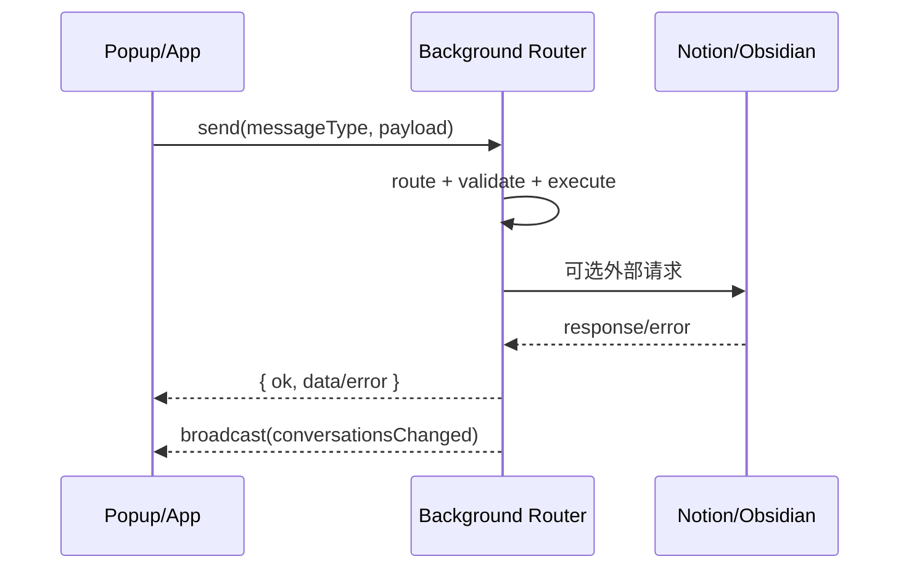

# API 与消息契约

## 页面目标

本页覆盖两类 API：

1. **扩展内部消息 API**（content/popup/app 与 background 间的协议）
2. **外部集成 API**（Notion、Obsidian Local REST、Cloudflare OAuth Worker）

## 内部消息契约总览

| 契约组 | 常量定义 | 典型用途 | 调用方 |
| --- | --- | --- | --- |
| CORE | `CORE_MESSAGE_TYPES` | conversation CRUD、列表分页、消息同步、图片回填 | popup/app/content -> background |
| NOTION | `NOTION_MESSAGE_TYPES` | 授权状态、Parent Page 列表、手动同步、job 状态、断开连接 | settings/conversations -> background |
| OBSIDIAN | `OBSIDIAN_MESSAGE_TYPES` | 设置保存、连接测试、同步 | settings/conversations -> background |
| ARTICLE | `ARTICLE_MESSAGE_TYPES` | 当前标签页正文抓取 | popup -> background |
| CHATGPT | `CHATGPT_MESSAGE_TYPES` | 提取 deep research / 结构化内容 | content -> background |
| CURRENT_PAGE | `CURRENT_PAGE_MESSAGE_TYPES` | 当前页捕获状态与触发 | popup/content |
| ITEM_MENTION | `ITEM_MENTION_MESSAGE_TYPES` | `$ mention` 候选搜索、插入文本构建 | content -> background |
| COMMENTS | `COMMENTS_MESSAGE_TYPES` | article comments 线程的 list/add/delete/migrate | detail/inpage panel -> background |
| UI | `UI_MESSAGE_TYPES` + `UI_EVENT_TYPES` | 打开 popup、打开 inpage comments panel、状态广播 | background <-> UI |
| CONTENT（非 router） | `CONTENT_MESSAGE_TYPES` | background -> content script 指令（例如打开 inpage comments panel） | background -> content |
| CONTENT（非 router） | `CONTENT_MESSAGE_TYPES.CAPTURE_VIDEO_TRANSCRIPT` | 触发字幕拦截后的 video 会话写入 | background -> content |
| FEISHU | `FEISHU_MESSAGE_TYPES` | 授权状态、断开连接、手动同步、job 状态 | settings/conversations -> background |

## CORE 关键消息

| 消息类型 | 入参关键字段 | 返回 | 说明 |
| --- | --- | --- | --- |
| `upsertConversation` | `payload.source`, `payload.conversationKey` | `conversation + __isNew` | 会话主记录 upsert |
| `mergeConversations` | `keepConversationId`, `removeConversationId` | merge result | 合并两条会话（消息与缓存随之迁移） |
| `syncConversationMessages` | `conversationId`, `messages`, `mode`, `diff` | 写入结果 | 可触发图片内联与增量写入 |
| `backfillConversationImages` | `conversationId`, `conversationUrl` | `updatedMessages`, `downloadedCount` 等 | 历史消息图片回填 |
| `getConversationListBootstrap` | `query{sourceKey,siteKey,limit?}` | 列表第一页 + cursor | 会话列表入口（bootstrap） |
| `getConversationListPage` | `query`, `cursor{lastCapturedAt,id}`, `limit?` | 列表分页 + cursor | 会话列表分页 |
| `findConversationBySourceAndKey` | `source`, `conversationKey` | conversation 或 `null` | 以“来源 + 会话 key”定位会话 |
| `findConversationById` | `conversationId` | conversation 或 `null` | 以 id 定位会话 |
| `getConversationDetail` | `conversationId` | 详情 + messages | 详情页入口 |
| `deleteConversations` | `conversationIds[]` | 删除结果 | 同步删除会话、消息与 mapping |

## NOTION 关键消息

| 消息类型 | 入参关键字段 | 返回 | 说明 |
| --- | --- | --- | --- |
| `getNotionAuthStatus` | 无 | `{ connected, workspaceName, token }` | 查询 Notion 连接状态；`token` 为完整 token（用于调试与 UI 展示 workspace 名），请避免在日志里输出 `accessToken` |
| `listNotionParentPages` | 无 | `{ pages, resolvedSaved }` | 拉取可用 Parent Page 列表；`pages[]` 为 `{id,title}`，`resolvedSaved` 用于确保“已保存 page id”在当前列表中可展示（即使不在搜索结果里） |
| `notionDisconnect` | 无 | `{ disconnected: true, clearedKeys: string[] }` | 断开连接：清理 token，并移除 Parent Page、OAuth 临时状态、Notion DB 缓存与 sync job 等相关存储键 |
| `notionSyncConversations` | `conversationIds[]` | `{ started: true, provider: 'notion' }` | 手动同步指定会话；依赖已连接 token + 已选择 `notion_parent_page_id`；若 provider 被禁用会返回 extra `{code:'sync_provider_disabled',provider:'notion'}` |
| `getNotionSyncJobStatus` | 无 | `{ provider: 'notion', job, instanceId }` | 查询后台同步 job 状态（running / done / error 等以 job store 为准） |
| `clearNotionSyncJobStatus` | 无 | `{ provider: 'notion', job: null, instanceId }` | 清空同步状态，便于 UI 重置提示 |

## 自动同步（Auto Sync）

自动同步是 background 内部能力（不通过 router 暴露新的消息类型）：当会话写入或 comments 变更发生时，会以 debounce 方式自动触发“同步当前会话”。

- **开关**：按 provider 分开存储，默认关闭：
  - `notion_auto_sync_enabled_v1`
  - `obsidian_auto_sync_enabled_v1`
  - `feishu_auto_sync_enabled_v1`
- **调度与队列**：队列与 alarm 名称集中定义在 `src/services/sync/auto-sync/auto-sync-keys.ts`，并通过 MV3 `alarms` 做一次性唤醒 flush（非定期任务）。
- **同步范围**：仅同步被影响的 `conversationId`。

## ITEM_MENTION（$ mention）关键消息

| 消息类型 | 入参关键字段 | 返回 | 说明 |
| --- | --- | --- | --- |
| `searchMentionCandidates` | `query`/`text`, `limit?` | `{query,candidates,scannedCount,truncatedByScanLimit}` | 从本地会话库检索候选并排序；为避免大库阻塞，background 侧会对扫描量与时间做上限 |
| `buildMentionInsertText` | `conversationId` | `{conversationId,markdown}` | 从本地 conversation detail 构建可插入的 Markdown；常见错误码：`INVALID_ARGUMENT` / `NOT_FOUND` / `EMPTY_DETAIL` |

## UI / CONTENT：打开页面内评论侧边栏（inpage comments panel）

这个入口用于把 **content 侧的“用户交互”** 变成 **content script 中的 UI 指令**：

1. content controller 监听 inpage 按钮的双击，在需要打开评论时发送 `UI_MESSAGE_TYPES.OPEN_CURRENT_TAB_INPAGE_COMMENTS_PANEL`（通常携带 `selectionText` 作为初始化引用内容）。
2. background 的 `ui-background-handlers.ts` 校验 sender tab，并用 `tabsSendMessage()` 向该 tab 发送 `CONTENT_MESSAGE_TYPES.OPEN_INPAGE_COMMENTS_PANEL`。
3. content script 收到 content message 后挂载/打开 inpage comments panel。

> `UI_MESSAGE_TYPES.OPEN_EXTENSION_POPUP` 仍存在，但不再是 inpage 双击的默认入口；它用于显式请求打开扩展 popup（依赖浏览器是否支持 `action.openPopup()`）。

## FEISHU 关键消息

| 消息类型 | 入参关键字段 | 返回 | 说明 |
| --- | --- | --- | --- |
| `getFeishuAuthStatus` | 无 | `{ connected, token }` | 查询 Feishu 连接状态 |
| `feishuDisconnect` | 无 | 清理结果 | 断开连接：清理 token、pending state、last error 与 sync job |
| `feishuSyncConversations` | `conversationIds[]` | `{ started: true, provider: 'feishu' }` | 手动同步指定会话；依赖已连接 token；若 provider 被禁用会返回 extra `{code:'sync_provider_disabled',provider:'feishu'}` |
| `getFeishuSyncStatus` | 无 | `{ provider: 'feishu', job }` | 查询后台同步 job 状态 |
| `clearFeishuSyncStatus` | 无 | `{ provider: 'feishu', job: null }` | 清空同步状态 |

## 外部 API 矩阵

| API | 入口 | 方法 | 关键参数 | 关键响应 |
| --- | --- | --- | --- | --- |
| Notion OAuth authorize | `https://api.notion.com/v1/oauth/authorize` | GET | `client_id`, `redirect_uri`, `state` | 授权码回调 |
| OAuth code exchange（worker） | `/notion/oauth/exchange` | POST JSON | `code`, `redirectUri` | `access_token` JSON |
| Notion API | `https://api.notion.com/*` | HTTPS | token + Parent Page + DB/page payload | 数据库/页面/block 读写 |
| Obsidian Local REST API | `http://127.0.0.1:27123/*`（可配置） | HTTP | API Key + path/body | 文件写入、patch、open |
| Feishu OAuth authorize | `https://accounts.feishu.cn/open-apis/authen/v1/authorize` | GET | `client_id`, `redirect_uri`, `state`, `scope` | 授权码回调 |
| Feishu OAuth code exchange（worker） | `/exchange` | POST JSON | `code`, `redirectUri` | `access_token` JSON |
| Feishu OAuth token refresh（worker） | `/refresh` | POST JSON | `refresh_token`, `redirectUri` | 新 `access_token` JSON |
| Feishu Convert API | `POST /docx/v1/documents/blocks/convert` | POST | `content`（markdown）, `content_type: 'markdown'` | DocX blocks + `first_level_block_ids` |
| Feishu DocX blocks API | `POST /docx/v1/documents/{docId}/blocks/{blockId}/descendant` / `children` | POST | block tree / flat children | 插入 blocks |
| Feishu Drive media upload | `POST /drive/v1/medias/upload_all` | multipart | `parent_type`, `parent_node`, file blob | `file_token` |
| Feishu image block bind | `PATCH /docx/v1/documents/{docId}/blocks/{imageBlockId}` | PATCH | `replace_image: { token }` | 绑定图片到 block |

## Notion OAuth Worker 交换流程

| 阶段 | 入口 / 文件 | 关键点 |
| --- | --- | --- |
| 用户发起授权 | `src/viewmodels/settings/useSettingsSceneController.ts` + Notion authorize URL | UI 生成随机 `state` 并写入 `notion_oauth_pending_state`，同时清空 `notion_oauth_last_error`；随后打开 `authorizationUrl=https://api.notion.com/v1/oauth/authorize` |
| 回调拦截 | `handleNotionOAuthCallbackNavigation()` | background 仅处理 `redirectUri=https://chiimagnus.github.io/syncnos-oauth/callback`，并校验 `state` 一致；失败会写入 `notion_oauth_last_error` 并清理 pending key |
| code 交换 | Worker `index.ts` | 扩展向 `/notion/oauth/exchange` 发送 `{ code, redirectUri }`；Worker 在服务端用 `NOTION_CLIENT_ID/SECRET` 调 Notion token endpoint |
| token 入库 | `setNotionOAuthToken()` | 扩展仅持久化 `access_token` 与 workspace 信息，不落地 `client_secret`；code exchange 采用 `12s timeout + 2 次尝试`（仅对 transient 错误重试） |

| 关键参数 | 位置 | 说明 |
| --- | --- | --- |
| `tokenExchangeProxyUrl` | `src/services/sync/notion/auth/oauth.ts` | `https://syncnos-notion-oauth.chiimagnus.workers.dev/notion/oauth/exchange` |
| Worker `NOTION_CLIENT_ID` | Cloudflare Worker env | OAuth client id，仅 Worker 可见 |
| Worker `NOTION_CLIENT_SECRET` | Cloudflare Worker env | OAuth client secret，仅 Worker 可见 |
| `redirectUri` | `src/services/sync/notion/auth/oauth.ts` + Worker | 固定为 `https://chiimagnus.github.io/syncnos-oauth/callback`，用于 code exchange 对齐 |

## 典型调用时序

## 契约稳定性规则

| 规则 | 原因 | 实践建议 |
| --- | --- | --- |
| 消息 type 必须来自 `message-contracts.ts` | 避免字符串漂移 | 禁止在组件内硬编码 type 字符串 |
| 返回结构统一 `{ok,data,error}` | 便于 UI 一致处理 | 扩展 handler 时保持 router 输出结构 |
| 新增消息先补测试再接 UI | 降低协议回归 | 补 smoke/unit 覆盖 message path |
| UI 只消费必要字段 | 减少耦合 | 不直接依赖 background 内部实现细节 |

## 常见 API 失败模式

| 失败场景 | 触发位置 | 处理策略 |
| --- | --- | --- |
| OAuth state 不匹配 | `handleNotionOAuthCallbackNavigation` | 拒绝写 token，保留错误信息 |
| Notion API 429 限流 | `listNotionParentPages`（settings handlers） | message 会附加 `Retry in about Xs.` 提示，并在 extra 中附带 `status/code/requestId`；通常需要等待后重试或降低并发 |
| worker 限流 429 | Cloudflare worker | 返回 `Retry-After`，前端重试或提示稍后 |
| Obsidian PATCH 失败 | `obsidian-sync-orchestrator.ts` | 自动回退 full rebuild |
| 消息 type 未注册 | background router fallback | 返回 `unknown message type` |
| Feishu Convert 权限不足 | `convert-api.ts` → orchestrator | 回退为纯文本 blocks 写入 |
| Feishu 图片绑定失败 | `image-block-binder.ts` → orchestrator | 记录 warning 不阻断同步，重试 3 次（429/5xx） |
| Feishu token 过期 | `resolveFeishuAccessToken()` | 自动刷新（直连或 proxy）；刷新失败则中断同步 |
| Feishu 文档被删 | `isFeishuDocxGoneError()` | 自动创建新 DocX 并更新 mapping |
| `$ mention` 插入失败（detail 为空） | `buildMentionInsertText` | 返回 `EMPTY_DETAIL`；通常需要重新采集该会话或先确认详情能正常打开 |
| 无法打开 popup | `OPEN_EXTENSION_POPUP` | 返回 `OPEN_POPUP_UNSUPPORTED` / `OPEN_POPUP_FAILED`；提示用户通过工具栏图标或检查浏览器能力 |
| 无法打开 inpage comments panel | `OPEN_CURRENT_TAB_INPAGE_COMMENTS_PANEL` | 返回 `OPEN_INPAGE_COMMENTS_PANEL_UNAVAILABLE/FAILED`；优先检查 sender tab、content script 是否仍在运行 |
| 视频字幕未加载或为空 | `CAPTURE_VIDEO_TRANSCRIPT` / `video-transcript-extract.ts` | 返回空结果或提示“未检测到字幕，未保存”；先确认视频页已开启字幕并等待轨道加载 |
