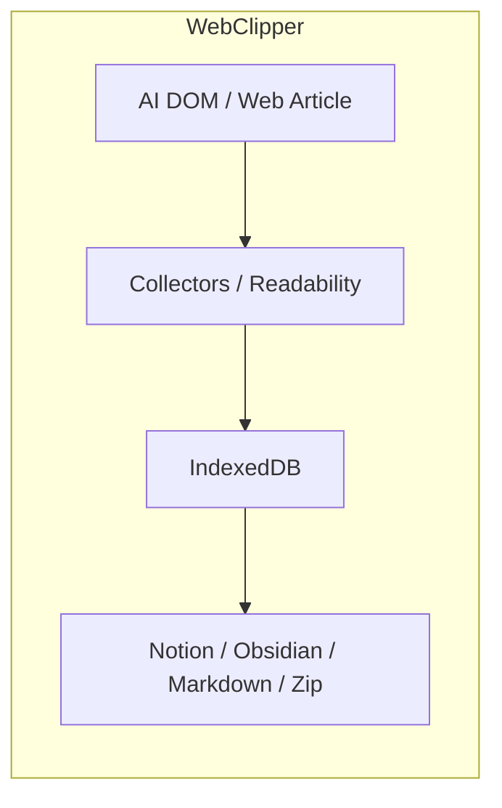

# 数据流

## 主要流程总览

| 流程 | 起点 | 中间层 | 终点 | 增量 / 重建策略 |
| --- | --- | --- | --- | --- |
| WebClipper 自动采集 | 支持站点 DOM | content controller → collectors → background storage | IndexedDB conversations / messages | 基于 runtime observer 与增量快照；article 图片命中 anti-hotlink 规则时会自动补 referer 并进入缓存链路 |
| WebClipper 手动保存网页 | 当前普通网页 | `Readability` 抽取 → article conversation | IndexedDB `article` 会话 | 重新抓取后按 `updatedAt` 决定下游是否重建 |
| WebClipper 视频字幕采集 | YouTube / Bilibili 视频页 | `document_start` 字幕拦截 → transcript extractor → video conversation | IndexedDB `video` 会话 | 仅保存已加载字幕；空字幕时不写入 |
| WebClipper 文章评论 / 注释线程 | article detail / inpage comments panel | comments handlers → `article_comments` store → panel refresh | IndexedDB `article_comments` + shared session panel refresh | local-first / orphan attach |
| WebClipper 外部同步 | popup / app 中选中的会话 | Notion / Obsidian / Feishu orchestrators | Notion 页面、Obsidian 文件、Feishu DocX、导出文件 | 基于 cursor/hash、目标存在性和目标结构决定 append / rebuild / skipped_unchanged |

## WebClipper：从页面到本地会话

### 1. 支持 AI 对话页面

1. `content.ts` 在所有 `http(s)` 页面注入内容脚本。
2. `src/services/bootstrap/content.ts` 先判断当前 host 是否属于支持站点；非支持站点是否显示 inpage UI 还取决于 `inpage_display_mode`（并兼容旧 `inpage_supported_only`）。
3. collectors registry 识别具体站点，把 DOM 统一为 `conversation + messages`。
4. background conversation handlers 处理 `SYNC_CONVERSATION_MESSAGES`，并把快照写入 IndexedDB；UI 通过相同存储读会话列表与详情。
5. 当对应来源的图片缓存开关开启时（chat: `ai_chat_cache_images_enabled`；article: `web_article_cache_images_enabled`），handler 会在写入前尝试把消息图片内联到 `contentMarkdown`（失败不阻塞主链路）。

- 若 `ai_chat_dollar_mention_enabled = true` 且当前站点在 `SUPPORTED_AI_CHAT_SITES` 中启用 `features.dollarMention`，content runtime 会启动 `$ mention` controller：输入框内 `$` 触发候选搜索（`ITEM_MENTION_MESSAGE_TYPES.SEARCH_MENTION_CANDIDATES`），选中后构建并插入 conversation markdown（`ITEM_MENTION_MESSAGE_TYPES.BUILD_MENTION_INSERT_TEXT`）。该链路只读取本地 IndexedDB，不涉及外部 API。
- Gemini 采集链会主动过滤 `.cdk-visually-hidden` 与 `[hidden]` 里的噪音文案，并把 blob 上传图内联为 `data:image/*`；Kimi 与 z.ai 则扩大附件卡片抓图范围，减少“消息有图但落库丢图”。
- article 图片命中 `anti_hotlink_rules_v1` 时，会优先走图片下载 / 缓存链路；这类缓存不应该被 `web_article_cache_images_enabled` 的关闭状态阻断。
- 图片内联失败会被记录并继续写入消息：设计目标是“先保证会话可保存”，而不是因为图片链路失败导致整条采集失败。

### 2. 普通网页文章

1. 用户手动触发“保存当前页”或网页端保存按钮。
2. background 向当前 tab 注入 `readability.js`，尝试抽取标题、作者、发布时间、HTML、markdown 和纯文本。
3. 抓取结果会被写成 `source='web'`, `sourceType='article'` 的 conversation，并同步一条 `messageKey = 'article_body'` 的正文消息。
4. background 再广播 `conversationsChanged`，让 popup / app 刷新列表。

### 3. 视频字幕采集

1. 用户在 YouTube / Bilibili 视频页开启字幕 / 切换字幕轨道，并通过右键菜单或 `VideosSection` 入口触发保存。
2. `video-transcript-interceptor.content.ts` 在 `document_start` 的 MAIN world 下拦截字幕响应，同时向页面请求 title / author / duration / thumbnail 等 meta。
3. `video-transcript-extract.ts` 优先读取被拦截的字幕响应，再回退到 DOM 字幕节点，最后才返回空结果。
4. `video-transcript-capture.ts` 将 cue 列表格式化为 transcript markdown，随后写入 `sourceType='video'` 的 conversation 和 `video_transcript` 消息。
5. `conversation-kinds.ts` 决定这个会话最终落到 `SyncNos-Videos`，并继续沿着 Notion / Obsidian / Markdown / Zip 的同一条下游链路输出。

### 4. 为什么有些来源不自动增量保存

- ChatGPT 与 Google AI Studio 都使用虚拟化渲染；自动 observer 常常只能看到当前可见 turns，容易漏掉离屏轮次，因此两者都退出 auto-save 集合、保留“手动保存优先”策略，全量历史由 collector 的 `prepareManualCapture()` 滚动扫描水合 + 跨扫描收割恢复。
- inpage 单击触发保存，双击打开页面内评论侧边栏（inpage comments panel），多击只触发彩蛋提示，不直接改变数据链路。

### 5. 会话详情里的手动图片补全（cache-images）

1. 用户在 conversation detail header 触发 `cache-images` 工具动作。
2. 前端通过 `BACKFILL_CONVERSATION_IMAGES` 消息调用 background job，并附带 `conversationId` 与 `conversationUrl`。
3. `image-backfill-job.ts` 读取该会话全部消息，复用 `inlineChatImagesInMessages()` 重新内联图片，并用 incremental diff 回写仅变化的消息。
4. 完成后 background 广播 `conversationsChanged`，前端刷新 detail，并向用户反馈 `updatedMessages / downloadedCount / fromCacheCount`。

### 6. 文章评论 / 注释线程

1. AppShell 或 Inpage bootstrap 持有唯一 sidebar controller。context identity 由 `canonicalUrl + conversationId` 组成，并分类为 same、attach-orphan、url-migrate、conversation-change 或 invalid。
2. context 切换触发新的 load/migrate generation 与 `AbortSignal`；旧 operation 被取消。加载失败进入 `stale_error`，保留最后成功 comments，而不是清空讨论区。
3. controller 通过 `comment-sidebar-session.ts` 原子发布 serializable snapshot 与稳定 actions；panel 用 identity-aware lease attach host，旧 lease 和重复 dispose 不影响新 host。
4. React surface 稳定单次 mount。`discussionReducer` 管理 active root、root/reply drafts、menu/delete confirmation、focus intent 与 submit 状态；context key 改变时确定性 reset。
5. `normalizeCommentThreadGraph()` 是唯一 roots/replies 归一化入口；UI 同时只挂载一个 active `ReplyComposer`，切换 root 时各自 draft 保留。
6. selection attachment、optional AI actions、notice 与 focus 分别由独立 hook 管理。评论提交、取消、菜单和侧栏关闭只通过显式控件触发，不提供评论专用键盘快捷键。
7. 根评论 capture 使用注入的 DOM source 写入 V2 locator；reader 兼容历史 V1。定位只接受受限 roots 上全局唯一 exact Range，并同步 panel-scoped passive/active markers。
8. save/reply/delete 使用 mutation generation；context change/dispose 后的晚到 completion 不再 refresh 旧 identity、清空 attachment 或触发 focus。panel close/cleanup 幂等释放 load、migration、dock、resize、lease、marker 与 React root。
9. comments background handlers 统一落库；reply 校验同 context root，root 删除递归清理后代。Notion、Obsidian 与 Zip 归档都消费 canonical thread graph。

定位链路明确不使用正文根兜底、环境字段硬拒绝、固定等待重试、比例滚动或父元素高亮；定位或 optional action 失败只进入 notice/stale error，不破坏评论事实与 drafts。

## WebClipper：从本地会话到外部目标

| 目标 | 真实输入 | 判定逻辑 | 结果 |
| --- | --- | --- | --- |
| Notion | 本地 conversation + messages + mapping + kind 定义 | `conversation-kinds.ts` 决定 DB / page schema；cursor 匹配则 append，不匹配或目标要求重建则 full rebuild | `SyncNos-AI Chats` / `SyncNos-Web Articles` 等数据库与页面 |
| Obsidian | 本地 conversation + messages + settings | 先决定 `incremental_append` 还是 `full_rebuild`；PATCH 失败时回退 full rebuild | `SyncNos-AIChats` / `SyncNos-WebArticles` 目录下笔记 |
| Feishu（DocX） | 本地 conversation + messages + mapping + path 配置 | 先计算内容 hash：一致且 DocX 可访问则 `skipped_unchanged`；否则创建/重建 DocX 并写入（Convert/图片失败回退纯文本 blocks） | 云盘根目录（或自定义路径）下的 DocX 文档；mapping 记录 `feishuDocId` 与 `feishuLastContentHash` |

### Feishu（DocX）同步的关键链路与失败模式

1. UI（popup/app）发起 `SYNC_CONVERSATIONS(provider='feishu')` → background handler 进入 Feishu orchestrator。
2. orchestrator 读取 `feishu_oauth_token_v1` 并在接近过期时刷新：若配置了 `feishu_oauth_client_secret` 则直连 Feishu token endpoint；否则通过 token exchange/refresh worker 刷新（避免在扩展端存 `client_secret`）。
3. 目录路径：优先读取 `feishu_chat_folder / feishu_article_folder / feishu_video_folder`（默认 `SyncNos-AIChats / SyncNos-WebArticles / SyncNos-Videos`），按 conversation kind 分流；若路径不存在，调用 Drive API 自动逐级创建目录并拿到 `folder_token`。
4. 增量跳过：计算 markdown 的 sha256 与 mapping 的 `feishuLastContentHash` 比对；一致时仍会校验目标 DocX 是否可访问（避免“文档被删/进回收站但仍显示跳过”）。若不可访问则创建新 DocX 并更新 mapping。
5. 写入策略（Convert API 四阶段流水线）：
   - **阶段 A — 图片预处理**：扫描 markdown 中的图片语法（例如 ``），将 `data:` URL 和 `syncnos-asset://` URL 替换为占位 URL（`https://syncnos.invalid/<prefix>/<sha256>.<ext>`），同时构建有序的 `imageSourcesInOrder` 元数据数组。
   - **阶段 B — Convert API 调用**：`POST /docx/v1/documents/blocks/convert` 将 markdown 转为 DocX blocks；`normalizeConvertedBlocksPreorder()` 重排为父先于子的前序遍历；`sanitizeConvertedBlocksForInsert()` 剥离只读字段。
   - **阶段 C — Block 插入**：优先用 descendant insertion（按 `firstLevelBlockIds` 批量插入子树，每批 ≤1000 blocks）；回退到 flat children insertion（每批 20 blocks）；批间 350ms 节流。
   - **阶段 D — 图片绑定**：Convert 后按位置顺序匹配 image blocks（`block_type === 27`），逐个下载 → 上传到 Feishu Drive（`POST /drive/v1/medias/upload_all`，`parent_type: 'docx_image'`）→ 绑定 file token 到 block（`PATCH .../blocks/{id}` with `replace_image`）。上传/绑定均有 3 次重试（429/5xx/99991400），指数退避 300ms×3^(n-1)+jitter。
   - **回退路径**：Convert 权限不足（401/403）或其他错误 → 回退为纯文本 blocks（8000 字符分块）；图片绑定失败 → 记录为 warning 不阻断同步。
6. 同步任务状态：每次运行会把 job snapshot 写入 `chrome.storage.local`（`feishu_sync_job_v1`）；扩展 reload 后 background 会把上一个实例遗留的 running job 标记为 aborted，避免 UI 永久停在“同步中”。
| Markdown / Zip 导出 | 本地 conversation + messages | 不依赖外部 API，直接按本地事实生成 | 用户本地文件系统 |
| 备份导入导出 | IndexedDB + `chrome.storage.local` | 以 Zip v2 为主，导入是 merge 而不是覆盖；会一并保留 `image_cache` 与 `article_comments` | 供迁移 / 恢复使用的本地备份 |

- 对 WebClipper 而言，外部目标都不是事实源；**事实源只有 IndexedDB 与非敏感 `chrome.storage.local`**。
- `conversationKinds` 当前定义了 `chat` / `article` / `video` 三种 kind：分别默认进入 `SyncNos-AI Chats` / `SyncNos-AIChats`、`SyncNos-Web Articles` / `SyncNos-WebArticles`、`SyncNos-Videos`。

### Notion：OAuth 连接、Parent Page 刷新与手动同步

1. **连接（OAuth）**：Settings UI 生成随机 `state`，写入本地 pending key，并打开 Notion authorize URL；background 监听 OAuth 回调 URL，校验 `state` 后通过 Cloudflare Worker 交换 token，成功后写入 token store，并清理 pending/error 状态（UI 会通过 `GET_AUTH_STATUS` polling 刷新连接状态）。
2. **Parent Page 刷新**：Settings UI 通过 background router 调用 `LIST_PARENT_PAGES`；background 会读取已保存 page id 并调用 `listNotionParentPages()` 统一执行 `/v1/search` 分页、过滤不可用页面，并在必要时 resolve 已保存 page id，返回 `{ pages, resolvedSaved }` 供 UI 兜底展示。
3. **手动同步**：会话列表选择会话后触发 `notionSyncConversations(conversationIds[])`；background 会先做 sync provider gate、token/parentPageId 校验与“是否已有 running job”判断，再启动 orchestrator detached job，并在结束时广播 `conversationsChanged` 刷新 UI。

> 存储键与门控键的命名以 `configuration.md` 为准（避免多处重复维护同一份 key 列表）。

## 状态、游标与映射

| 状态对象 | 位置 | 关键字段 | 作用 |
| --- | --- | --- | --- |
| WebClipper `sync_mappings` | IndexedDB | `notionPageId`, `lastSyncedMessageKey`, `lastSyncedSequence`, `lastSyncedAt` | 决定 Notion / Obsidian 是否可增量追加 |
| WebClipper conversation | IndexedDB | `sourceType`, `source`, `conversationKey`, `lastCapturedAt` | UI 排序、导出、同步、备份的基础 |
| WebClipper message | IndexedDB | `messageKey`, `sequence`, `updatedAt`, `contentMarkdown` | 生成 Notion blocks / Markdown / Obsidian 内容；图片可在实时采集或 backfill 时内联更新 |
| WebClipper `article_comments` | IndexedDB | `canonicalUrl`, `conversationId`, `parentId`, `authorName`, `quoteText`, `commentText`, `locator?`, timestamps | article 评论事实源；thread graph 负责异常历史图归一化，DTO 负责跨 runtime 字段完整性 |
| WebClipper 图片缓存开关 | `chrome.storage.local` | `ai_chat_cache_images_enabled`, `web_article_cache_images_enabled`, `anti_hotlink_rules_v1` | 分别控制 chat/article 消息图片内联策略；`anti_hotlink_rules_v1` 命中时会自动缓存 article 图片；历史消息需手动触发 backfill |

## 图表

## 常见失败模式与恢复

| 失败模式 | 发生位置 | 典型表现 | 恢复方向 |
| --- | --- | --- | --- |
| Parent Page / token 缺失 | WebClipper Notion 同步前 | 直接阻止写入或报错 | 回到配置页补齐授权与 Parent Page |
| Parent Page 列表加载失败 / 429 | WebClipper Notion 设置页 | 下拉为空、提示稍后重试或显示 retry seconds | 等待后重试；检查 Notion 连接状态与限流；必要时断开重连 |
| article 抽取失败 | WebClipper article fetch | `No article content detected` | 检查页面是否有足够正文或改用支持站点保存 |
| 缓存图片按钮不可见或“点了没变化” | WebClipper detail tools / backfill job | article 会话无按钮，或回填结果 `updatedMessages=0` | 先确认是 chat 会话，再检查消息里是否存在可下载图片链接 |
| 旧版或被裁剪的备份不含文章评论 | WebClipper comments / backup | 旧备份或缺失 `assets/article-comments/index.json` 时，恢复后看不到评论线程 | 当前版本的 Zip v2 已覆盖该链路；若遇到旧备份，先确认是否缺少该索引文件 |
| cursor 缺失或不匹配 | WebClipper Notion / Obsidian | 从 append 退回 rebuild | 检查本地 mapping 和目标文件 / 页面状态 |
| Obsidian PATCH 失败 | Obsidian orchestrator | 增量追加失败 | orchestrator 自动回退 full rebuild |
| 发布版本不一致 | workflow | `manifest version mismatch` | 检查 `wxt.config.ts` 与 tag |
