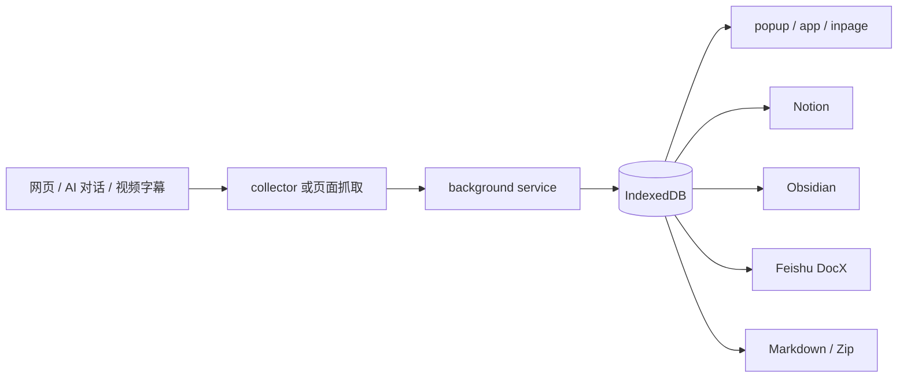

# SyncNos WebClipper 文档

本目录只保存长期有效的架构、协议、模块和运维知识。功能计划、阶段验收、截图比对和一次性 Gate 结果应留在 `.github/features/**`，不进入 canonical docs。

## 先从哪里开始

| 你要解决的问题 | 阅读 |
| --- | --- |
| 了解产品和主要用户流程 | 本页、[README](../README.md) |
| 理解运行时、分层和依赖方向 | [architecture.md](architecture.md) |
| 追踪采集、落库、同步与导出链路 | [data-flow.md](data-flow.md) |
| 找设置键、默认值和 manifest 来源 | [configuration.md](configuration.md) |
| 理解 IndexedDB、storage 和备份 | [storage.md](storage.md) |
| 新增或修改 background 消息 | [api.md](api.md) |
| 排查构建、Zen XPI 或评论定位 | [troubleshooting.md](troubleshooting.md) |
| 配置 Feishu OAuth / Worker | [feishu-setup.md](feishu-setup.md) |
| 检查权限、凭据和备份边界 | [security.md](security.md) |

## 模块入口

- [WebClipper 采集与同步](modules/webclipper.md)
- [文章评论与精确锚点](modules/comments.md)
- [视频字幕采集](modules/videos.md)
- [文章阅读器与朗读](modules/reader.md)

## 产品模型

WebClipper 把三类来源统一为本地 conversation：

| 来源 | `sourceType` | 主要内容 |
| --- | --- | --- |
| AI 对话 | `chat` | 标准化消息序列 |
| 网页正文 | `article` | `article_body` Markdown；可附带本地评论线程 |
| 视频字幕 | `video` | `video_transcript`，可带时间戳 |

所有内容先写入浏览器本地数据库，再由用户选择同步到 Notion、Obsidian、Feishu，或导出 Markdown / Zip。外部目标不是事实源。

## 核心用户流程

## 不可破坏的业务规则

- **本地优先**：采集成功以本地落库为准，远端同步失败不得丢失本地内容。
- **手动抓取虚拟列表**：ChatGPT 与 Google AI Studio 不做自动增量保存。
- **图片是增强项**：图片缓存或反防盗链失败不能阻断文本保存。
- **Reader 只作用于 article / video**：AI chat 不显示阅读器工具。
- **评论是 article 的本地注释层**：根评论可保存精确 locator；定位失败明确报 unavailable，不做模糊回退。
- **敏感数据不进备份**：OAuth token、client secret 等必须由 denylist 排除。
- **同步是派生流程**：Notion、Obsidian、Feishu 的 mapping/cursor 可重建，不能反向覆盖本地事实。

## 文档维护规则

- `README.md` 只放产品入口、开发启动和文档导航。
- `AGENTS.md` 只放不看就容易踩坑的仓库规则。
- 每个主题只保留一个权威页面；其他页面只链接。
- 阶段计划、审计、手工验收和历史截图放 `.github/features/**`。
- 每次文档整理后更新 [GENERATION.md](GENERATION.md)。
